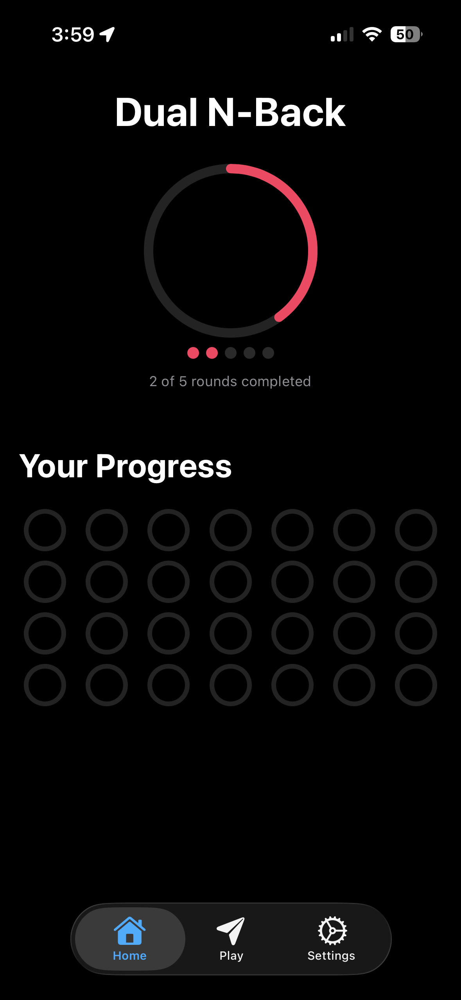
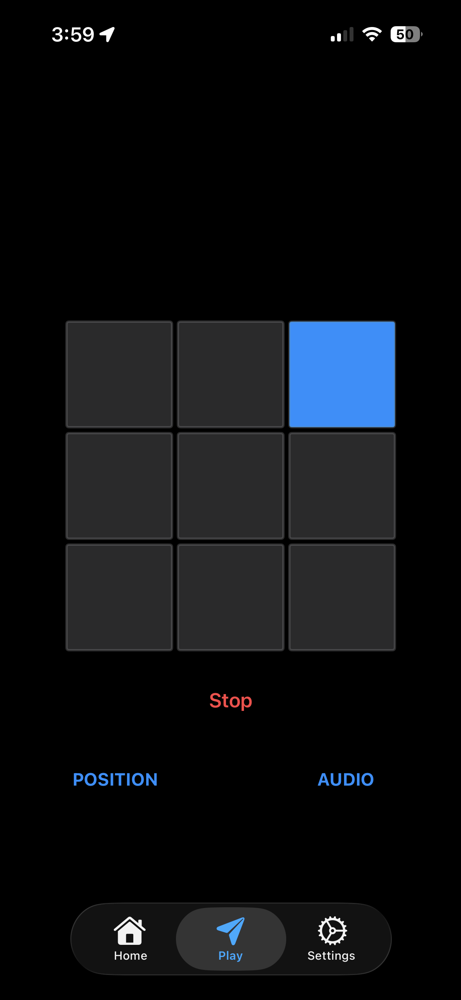
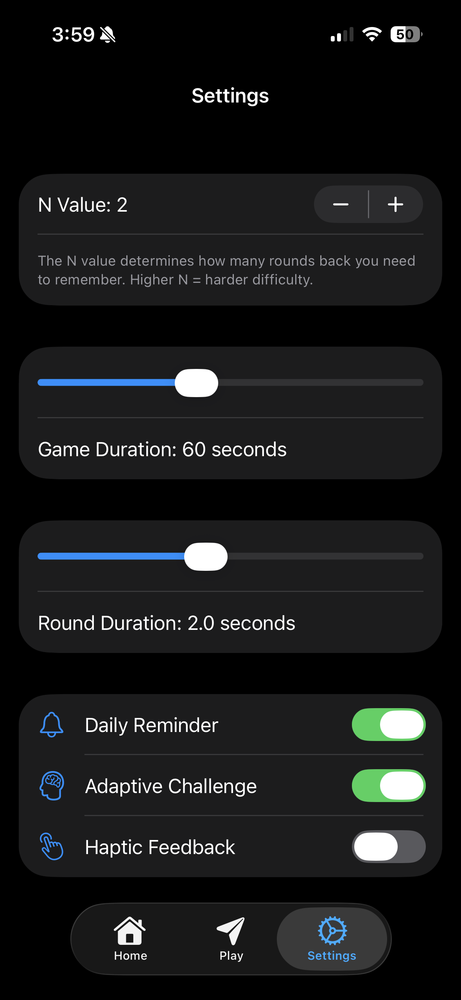

# 🧠 Dual N-Back – iOS (SwiftUI)

A modern, fully native **Dual N-Back training game** built entirely in Swift for iOS using SwiftUI.

This project combines cognitive training, adaptive difficulty, and habit tracking into a clean and engaging experience — built as an open-source portfolio project and designed to be production-ready.

---

## 📱 Platform

- **iOS**
- **Minimum Version:** iOS 26.2  
- **Built With:** Swift + SwiftUI  
- **Architecture:** MVC + Clean Architecture principles  
- **Storage:** Core Data + UserDefaults  
- **Dependencies:** 100% native Swift (no third-party libraries)

---

## 🎮 Features

### Core Gameplay

- Adjustable **N-Level**
- **Dual stimulus system** (visual + audio)
- Real-time performance feedback
- **Adaptive difficulty** based on performance

### Progress & Tracking

- Persistent statistics tracking
- Session history stored with **Core Data**
- Lightweight settings storage via **UserDefaults**
- Local notifications to encourage consistency
- Built-in **habit tracking** to reinforce daily training

### User Experience

- Full **Dark Mode** support
- Clean, SwiftUI-native interface
- Responsive and smooth animations

---

## 🏗 Architecture

This project follows a structured **MVC approach** with Clean Architecture principles applied for separation of concerns.

- Clear separation between UI, business logic, and persistence
- Native SwiftUI state management
- Modular and maintainable codebase
- Designed for extensibility (future Game Center / CloudKit support)

---

## 🧠 What is Dual N-Back?

Dual N-Back is a cognitive training exercise designed to improve working memory and fluid intelligence.

In this version:

- You must match the current visual and audio stimulus
- Against the stimulus shown **N steps back**
- Difficulty scales automatically as performance improves

---

## 💾 Data Persistence

### Core Data

Used for storing:

- Session history
- Performance metrics
- Habit tracking records

### UserDefaults

Used for:

- Preferences
- Selected N-level
- Lightweight configuration

---

## 🚀 Getting Started

### Requirements

- macOS with the latest version of Xcode installed
- iOS 26.2+ Simulator or physical iOS device
- Swift (latest stable version bundled with Xcode)

---

### Installation

1. Clone the repository:

```bash
git clone https://github.com/SamanSathenjeri/dual-n-back.git
```

2. Navigate into project directory
```bash
cd dual-n-back
```

3. Open the Xcode Project
```bash
open DualNBack.xcodeproj
```

4. Select a simulator or connected iOS device.
5. Press ⌘ + R to build and run.

### Usage
1. Launch the app.

2. Select your desired N-Level.

3. Start a training session.

4. Match:
- The visual stimulus and the audio stimulus against the one shown N steps back.

5. Track your performance and build your daily streak using the habit tracker.

6. Enable notifications to stay consistent with your training.

---

## 📸 Screenshots






---

## 🔔 Future Improvements
- Game Center integration
- CloudKit sync
- Advanced performance analytics
- Custom sound packs
- Expanded statistics dashboard
- UI refinements and animation polish
- Accessibility enhancements
- Performance optimizations

---

## 🤝 Contributing

Contributions are welcome and appreciated.

If you would like to contribute:
1. Fork the repository.

2. Create a new branch for your feature or fix:

```bash
git checkout -b feature/your-feature-name
```

3. Commit your changes with clear commit messages.

4. Push to your fork:

```bash
git push origin feature/your-feature-name
```

5. Open a Pull Request describing your changes.

### Contribution Guidelines
- Follow the existing project structure.
- Maintain separation of concerns (MVC + Clean Architecture principles).
- Keep code readable and well-documented.
- Test changes before submitting a pull request.

---

## 🎯 Project Purpose

This project was built as:
- A portfolio-level SwiftUI application
- A practical implementation of Dual N-Back cognitive training
- A demonstration of Core Data integration in a SwiftUI environment
- A clean, fully native iOS app without third-party dependencies
- A foundation for future expansion into a production-ready App Store release
- The goal is to combine cognitive training, habit formation, and modern iOS architecture into a maintainable and extensible codebase.